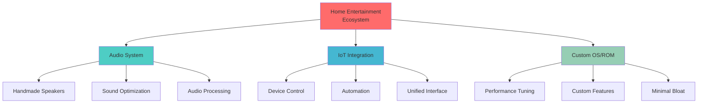
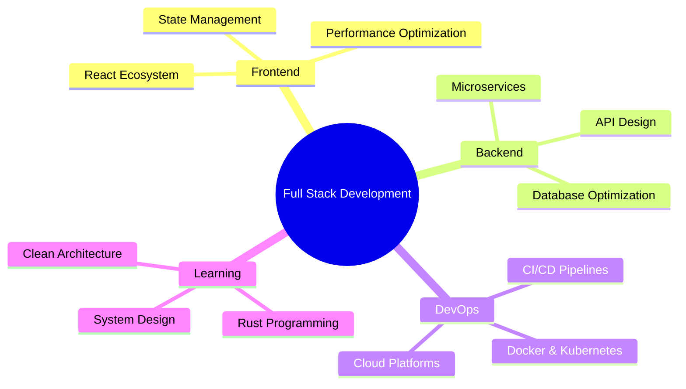

<div align="center">
  
</div>

<div align="center">
  
### 📍 Bắc Ninh, Việt Nam

</div>

### 📫 Connect

<div align="center">
  
[](https://fb.com/nguyen.thanh.nam.432103)
[](https://instagram.com/ntn_carameoo)
<div align="center">
  
### 🧠 Philosophy

```rust
// My approach to building systems
fn build_system() -> Result<()> {
    let philosophy = Philosophy {
        performance: Priority::Maximum,
        user_experience: Focus::Paramount,
        dependencies: DependencyPolicy::MinimalAndNecessary,
        ownership: CodeOwnership::Complete,
        approach: BuildingStyle::FromScratch,
    };
    
    // I don't just use frameworks - I understand and build them
    // Every line of code serves a purpose
    // Performance is not negotiable
    
    Ok(())
}
```

</div>

---

### 👨‍💻 Who Am I

<table>
<tr>
<td width="50%">

#### 🔧 Technical Identity
- 🏗️ **System Builder** - From OS to frameworks
- ⚡ **Performance Obsessed** - Every millisecond counts
- 🎯 **User-Centric** - UX is not optional
- 🔬 **Deep Diver** - Understanding systems from the ground up
- 🛠️ **Framework Creator** - Building tools for myself
- 📱 **ROM Developer** - Custom Android experiences
- 🌐 **Ecosystem Architect** - Connecting everything together

</td>
<td width="50%">

#### 🎨 Beyond Code
- 🎸 **Music Enthusiast** - Guitar, Organ, Vocals
- 🥊 **Muay Thai Practitioner** - Discipline & Strength
- 🔊 **Audio Engineer** - Sound optimization
- 🔨 **Hardware Builder** - Handmade speakers
- 🏠 **Home Automation** - IoT integration
- 💪 **Fitness Focused** - Physical & Mental discipline
- 🎯 **Goal-Driven** - Systematic approach to life

</td>
</tr>
</table>

<div align="center">

**Core Mission:** Building an integrated home entertainment ecosystem from scratch

</div>

---

### 🛠️ Tech Arsenal

<details open>
<summary><b>⚙️ System Level & Low-Level Programming</b></summary>
<br>


**Focus:** OS development, Custom ROMs, Performance optimization, Memory management

</details>

<details open>
<summary><b>🌐 Full Stack Development</b></summary>
<br>


**Philosophy:** Minimal dependencies, maximum control, optimal performance

</details>

<details open>
<summary><b>🏠 IoT & Hardware Integration</b></summary>
<br>


**Building:** Home entertainment ecosystem with custom audio systems

</details>

<details open>
<summary><b>🗄️ Data & Infrastructure</b></summary>
<br>


**Approach:** Self-hosted when possible, cloud when necessary

</details>

---

### 🎯 Current Focus & Projects



---

### 💡 Code Philosophy

<div align="center">

| Principle | Implementation |
|-----------|---------------|
| ⚡ **Performance** | Profile first, optimize always. No unnecessary overhead |
| 👥 **User Experience** | Intuitive, responsive, delightful. UX drives architecture |
| 🎯 **Minimalism** | Zero unused dependencies. Every import justified |
| 🔧 **Self-Reliance** | Build frameworks, don't just consume them |
| 📚 **Deep Understanding** | Know how it works under the hood |
| 🏗️ **Complete Features** | Fully functional, not just MVP |

</div>

---

### 📊 GitHub Statistics

<div align="center">
  
  
</div>

<div align="center">
  
</div>

<div align="center">
  
</div>

---

### 🎸 Life Beyond Code

<table>
<tr>
<td width="33%" align="center">

#### 🎵 Music & Arts
- Guitar player
- Organ enthusiast  
- Vocal training
- Audio production

</td>
<td width="33%" align="center">

#### 🥊 Physical Discipline
- Muay Thai training
- Strength building
- Endurance focus
- Mental fortitude

</td>
<td width="33%" align="center">

#### 🔨 Hardware & Craft
- Speaker building
- Audio optimization
- Electronics tinkering
- Physical prototyping

</td>
</tr>
</table>

<div align="center">

**Discipline in code. Discipline in life.**

</div>

---

### 📈 Contribution Timeline

<div align="center">
  
</div>

---

### 💭 Developer Mindset

<div align="center">
  
> "I don't build applications. I build systems."

> "Dependencies are liabilities. Understanding is an asset."

> "Performance is a feature. User experience is the product."

</div>

---


**Open to collaborating on:** System-level projects, IoT ecosystems, Performance optimization, Custom frameworks

</div>

---

<div align="center">
  
  
  ### 🔥 Building the future, one system at a time
  
  
</div>
